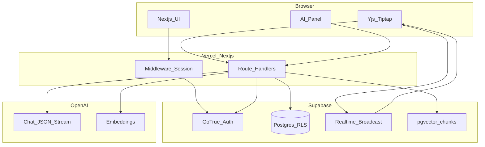
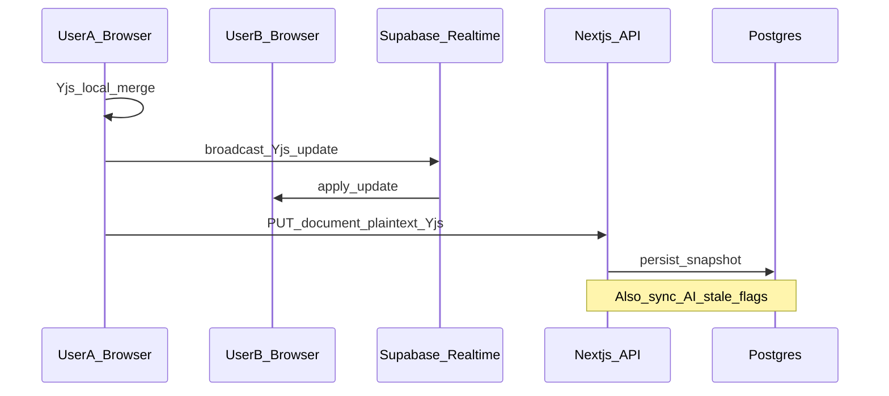
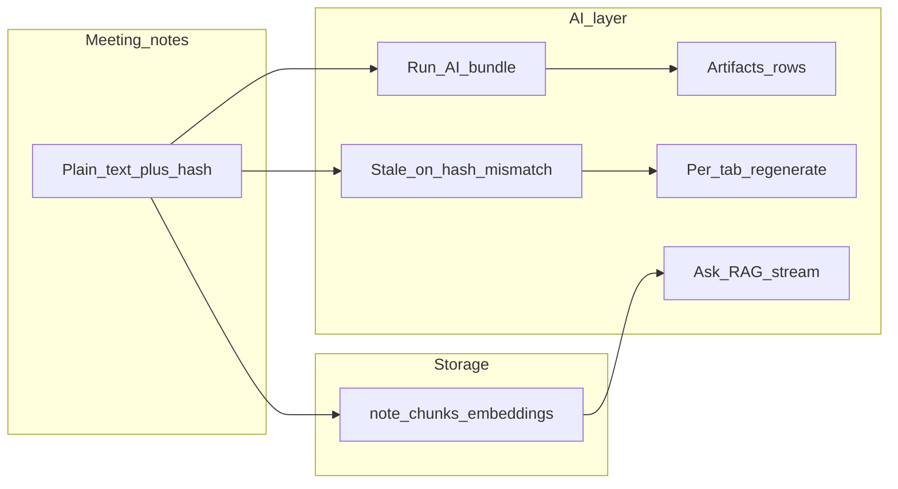
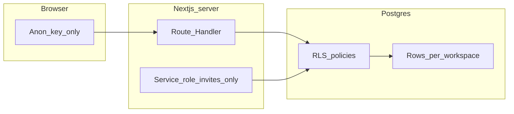

# Collab Notes AI — Collaborative meeting workspace

> A **full-stack** assignment: shared meeting notes with **real-time collaboration**, **workspace-level security**, and an **AI copilot** that produces structured outputs, reacts when notes change, and answers **grounded questions** over your content.

---

## What I built (in one paragraph)

Teams get **private workspaces**. Inside a workspace, everyone with access edits **one rich-text document** together: changes merge safely using a **CRDT** (conflict-free), sync over the network via **Supabase Realtime**, and **persist** to Postgres. A side **AI panel** runs on the **saved notes**: it can generate a **summary**, **action items** (with owner, priority, due date when detectable), **decisions**, and a **follow-up email**—all stored in the database, **editable**, and marked **stale** when the underlying notes change so you can **regenerate** selectively. **Ask mode** chunks the notes, stores **embeddings** in **pgvector**, and streams an answer grounded in the most relevant chunks. **Invites** let you add collaborators by link. Everything is enforced with **Row Level Security** so users only touch data they are allowed to see.

---

## Feature map (assignment alignment)

| Area | What you can do |
|------|------------------|
| **Auth & access** | Sign up / sign in (Supabase Auth). Optional **demo mode** (`NEXT_PUBLIC_SKIP_AUTH`) uses **anonymous** sessions so reviewers can open the app without credentials (enable Anonymous in Supabase). |
| **Workspaces** | Create, rename, delete (owners), **dashboard** with search and “stale AI” hints. |
| **Collaboration** | **Yjs + Tiptap** editor: concurrent typing, **debounced autosave** of Yjs state + plain text to Postgres. **Broadcast** channel syncs live updates between browsers. |
| **AI copilot** | **Run AI** → structured JSON (Zod-validated) → persisted **artifacts**. Per-section **Regenerate**. **Editable** fields saved back to the DB. |
| **AI lifecycle** | **Content hash** on notes; artifacts store `source_content_hash` + `stale` flag updated on save so outputs do not pretend to be fresh after edits. |
| **Ask mode** | Re-index chunks + embeddings; **vector search** RPC; **streaming** answer with strict “use excerpts” prompting. |
| **Invites** | Generate invite link; accept flow adds **membership** (service role used only where needed for token lookup). |

---

## High-level architecture

The diagram below is a **map of moving parts**. The subsection **“How to read this architecture”** walks the same boxes and arrows in order so you can follow a request end-to-end.

The app is intentionally **one Next.js codebase**: UI + **Route Handlers** (`app/api/...`) run on the server; **Supabase** is the database, auth, and realtime transport; **OpenAI** is used only on the server for LLM + embeddings.

### How to read this architecture (what each part does)

**Browser — three surfaces, two “pipes”**

- **Next.js UI** — Dashboard, auth screens, layouts. Every navigation first hits **middleware** on the server (see **Vercel**), which refreshes the Supabase session from cookies and decides whether to redirect (e.g. to login) unless demo mode is on.
- **Yjs + Tiptap** — The collaborative editor. It does **two** things in parallel: (1) **broadcast** small Yjs updates over **Supabase Realtime** so another tab or teammate applies the same edit without waiting for the database; (2) on a **debounced timer**, **POST/PUT** to **Route Handlers** to save the full Yjs blob plus **plain text** into **Postgres** (so reloads and AI see durable state).
- **AI panel** — Only talks to your **Route Handlers** (never to OpenAI directly from the browser with a secret key). That keeps API keys server-side and lets every query run **as the logged-in user**, so **RLS** on Postgres still applies.

**Vercel / Next.js**

- **Middleware + session** — Uses the **anon** key + cookies to validate or refresh the JWT. That is why `NEXT_PUBLIC_SUPABASE_*` is safe in the client: it is not the service role.
- **Route Handlers** (`app/api/...`) — These are your **backend**. They create a server Supabase client with the user’s cookies, perform `insert` / `update` / `select`, call **`match_note_chunks`** against **pgvector** rows, and call **OpenAI** for chat and embeddings. One deployment unit: no separate Express server to host.

**Supabase**

- **GoTrue (Auth)** — Issues JWTs; `auth.uid()` inside Postgres policies is derived from this identity.
- **Postgres + RLS** — Source of truth for workspaces, members, documents, AI artifacts, and note chunks. Policies are why a random user cannot read another team’s rows even if they guess a UUID.
- **Realtime broadcast** — Ephemeral **Yjs sync** between browsers (not a second source of truth for the full document; the DB snapshot is still authoritative on refresh).
- **pgvector / chunks** — The `note_chunks` table holds text slices and embeddings for **Ask** retrieval.

**OpenAI**

- **Chat (JSON + stream)** — Meeting bundle and per-tab regenerate; Ask uses streaming for the final answer.
- **Embeddings** — Powers chunk indexing and the query vector for `match_note_chunks`.

**Arrows in plain English**

| Arrow | Meaning |
|-------|--------|
| UI → MW | Every page load / navigation: refresh session, enforce auth redirects. |
| Editor → RT | Live CRDT updates: fire-and-forget broadcast to peers. |
| Editor → API | Autosave: persist Yjs + plaintext; update content hash; mark AI stale if needed. |
| Panel → API | Run AI, regenerate, save edited artifacts, Ask, re-index. |
| API → Auth / PG / Vec | Server verifies identity and reads/writes only allowed rows. |
| API → Chat / Emb | Server-side LLM calls using your `OPENAI_API_KEY`. |
| RT → Editor | Incoming broadcast: apply remote Yjs update into the local doc. |

---

## How collaboration works (concept → implementation)

The **sequence diagram** is one happy path (two editors + save). The numbered list after it explains **each message** and why **Realtime** and **HTTP** both appear.

### How to read this sequence (step by step)

1. **`Yjs_local_merge` (User A)** — User A types in Tiptap. The change goes into the **Yjs document** first. If User A had been offline and came back, Yjs would also merge any pending remote updates here; that is the CRDT guarantee (order-independent merge).

2. **`broadcast_Yjs_update` (User A → Realtime)** — After a local change, the client encodes a **Yjs binary update** (small delta, not the whole document) and publishes it on a **workspace-scoped channel** in Supabase Realtime. This is **low latency** and avoids hammering Postgres on every keypress.

3. **`apply_update` (Realtime → User B)** — User B’s browser receives the payload and applies it with origin `"remote"` so the editor does not echo the same update back out to the channel in a loop.

4. **`PUT` document (User A → Next.js API → Postgres)** — Separately from broadcast, a **debounced** timer (e.g. after typing pauses) sends the **full encoded Yjs state** plus **flattened plain text** to your API route. The API writes to the `documents` row for that workspace. Plain text is what downstream features use (hashing, “Run AI”, chunking).

5. **`Also_sync_AI_stale_flags` (API + DB)** — On that same save path, the server compares the new **content hash** of the notes to each AI artifact’s stored `source_content_hash`. If they differ, artifacts are marked **stale** so the UI does not imply the AI output is still guaranteed to match the notes.

**Why both Realtime and HTTP exist** — Realtime is for **speed and feel** (Google-Docs-like typing). HTTP + Postgres is for **durability**, **security** (RLS), and **AI/RAG** that must read a consistent snapshot from the server.

---

## How AI fits in (concept → implementation)

The **flowchart** is not a runtime loop — it shows **where data is produced and consumed**. The three “pipelines” after it map each arrow group to a user-facing feature (bundle, staleness/regenerate, Ask).

### How to read this AI diagram (data flow)

Think of **three parallel pipelines** that all start from the same saved notes (`Plain_text_plus_hash`):

**Pipeline A — One-shot “meeting intelligence” (`Run_AI_bundle` → `Artifacts_rows`)**

- When the user clicks **Run AI**, the **Route Handler** loads the latest **authorized** plain text from Postgres (never trust the browser alone).
- It calls the chat model once with a **JSON schema style** prompt, parses the result with **Zod**, and writes **four** logical outputs into **`ai_artifacts`** (summary, tasks, decisions, email). Each row stores the **JSON payload** plus `source_content_hash` = hash of the notes at generation time.
- That is why the diagram shows a direct edge **T → Run → Art**: artifacts are a **materialized** view of the model’s interpretation of `T` at that moment.

**Pipeline B — “Is this output still trustworthy?” (`Stale_on_hash_mismatch` → `Per_tab_regenerate`)**

- On every document save, the server recomputes the hash of `T`. Any artifact whose `source_content_hash` no longer matches is flipped to **stale** (see note on the collaboration sequence).
- The UI shows a **Stale** badge and lets the user **regenerate only one tab** (e.g. tasks only). That path is **`Regen`**: it sends both the **new notes** and the **current JSON** for that tab so manual edits can be merged intelligently in the prompt, then overwrites that artifact row and clears stale for that type.

**Pipeline C — Ask mode (`note_chunks_embeddings` → `Ask_RAG_stream`)**

- **`T → Chunks`**: a background **index** route splits plain text into overlapping segments and writes **`note_chunks`** rows.
- Embeddings are stored next to each chunk (pgvector column). **`Chunks → Ask`**: the Ask handler embeds the **user question**, runs **`match_note_chunks`** (nearest neighbors, with a **member check** in SQL), injects the top excerpts into the prompt, and **streams** the answer back to the panel.

**Why the diagram branches** — **Run** and **Ask** are independent features (bundle vs RAG), but **both** depend on the same underlying truth: **saved notes in Postgres**. **Stale** ties the bundle outputs back to edits so the product behaves like one system, not a disconnected “AI widget.”

Details for models, prompts, and tradeoffs: **[`AI_USAGE.md`](AI_USAGE.md)**.

---

## Security model (why Supabase RLS matters)

Access is not “hidden in the UI”—the **database** enforces it.

### How to read this security diagram

- **Browser / `Anon_key_only`** — The published `NEXT_PUBLIC_SUPABASE_ANON_KEY` never bypasses RLS. The browser (and server routes using the **user’s JWT in cookies**) can only see rows that policies allow for `auth.uid()`.
- **`Route_Handler`** — Typical API path: `createServerSupabaseClient()` forwards the user session. Every `select` / `insert` / `update` is evaluated as **that user**, so a forged `workspace_id` in the URL still returns **zero rows** if they are not a member.
- **`Service_role_invites_only`** — The **service role** key is **not** exposed to the client. It is used in a **small** number of server routes (e.g. resolving an invite **by token** before the user is a member). Anything else uses the normal user client so RLS stays the default gate.
- **`RLS_policies` → `Rows_per_workspace`** — Policies tie rows to **workspace membership** (and **creator** visibility where needed for triggers). That is how **multi-tenant** isolation is enforced even if two teams use the same app deployment.

Concrete rules in code live in [`supabase/migrations/`](supabase/migrations/) (e.g. `workspace_members`, `documents`, `ai_artifacts`, `note_chunks`).

That pattern matches how you’d ship a real product: **defense in depth** (UI + API + DB).

---

## Repository layout

| Path | Role |
|------|------|
| [`client/`](client/) | Next.js 16 app (App Router, TypeScript, Tailwind). |
| [`client/app/api/`](client/app/api/) | Server routes: workspaces, document save, AI run/regenerate, indexing, ask, invites. |
| [`supabase/migrations/`](supabase/migrations/) | Schema, RLS, triggers (auto profile, auto owner row + empty document), `match_note_chunks`. |
| [`AI_USAGE.md`](AI_USAGE.md) | AI behavior, models, RAG, limitations. |
| [`SUBMIT_CHECKLIST.md`](SUBMIT_CHECKLIST.md) | Fast setup: SQL order, env vars, deploy. |
| [`DEMO_SCRIPT.md`](DEMO_SCRIPT.md) | Suggested demo video flow. |

---

## Tech stack (at a glance)

| Layer | Choice | Why |
|-------|--------|-----|
| Frontend | **Next.js 16**, React 19 | App Router, server components + route handlers, easy deploy on Vercel. |
| Auth & DB | **Supabase** | Managed Postgres, Auth, Realtime, **pgvector** in one place. |
| Collaboration | **Yjs + Tiptap** | Industry-standard CRDT + rich text without building an editor from scratch. |
| AI | **OpenAI** (`gpt-4o-mini`, `text-embedding-3-small` by default) | Structured JSON + embeddings; configurable via env. |
| Validation | **Zod** | Safe parsing of model output before persisting. |

---

## Local run (short)

1. Apply SQL migrations in [`supabase/migrations/`](supabase/migrations/) in **filename order** (see [`SUBMIT_CHECKLIST.md`](SUBMIT_CHECKLIST.md) if you need the fastest path).
2. Copy [`client/.env.example`](client/.env.example) → `client/.env.local` and fill keys.
3. `cd client && npm install && npm run dev`

**Deploy:** point Vercel (or similar) at the **`client`** directory and mirror the same environment variables.

---

## Optional recruiter / demo mode

Set **`NEXT_PUBLIC_SKIP_AUTH=true`** and enable **Anonymous** sign-in in Supabase so visitors land on **`/app`** without typing credentials. Turn it off for a normal email/password experience.

---

## Scripts (`client/`)

| Command | Purpose |
|---------|---------|
| `npm run dev` | Local development |
| `npm run build` | Production build (run before submit) |
| `npm start` | Serve production build locally |

---

## License

Private assignment repository.
