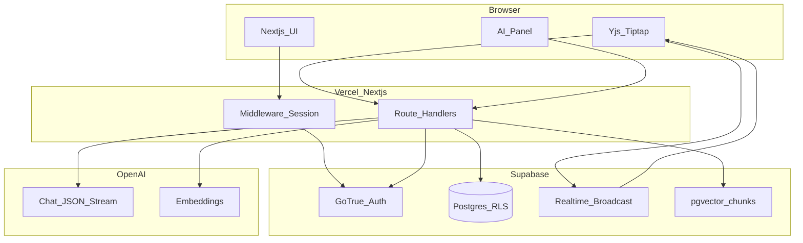
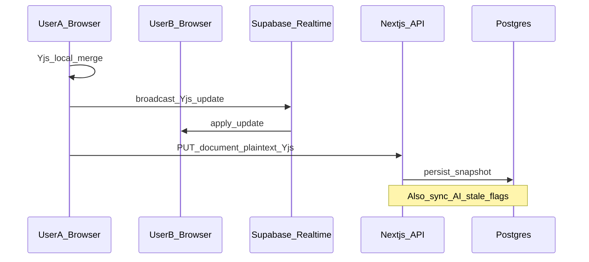
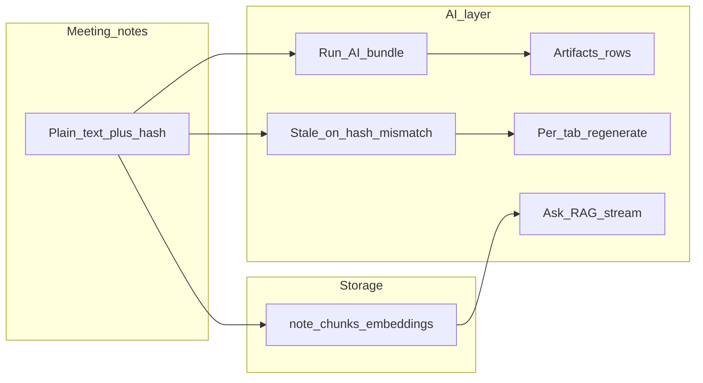

# Collab Notes AI — Collaborative meeting workspace

> A **full-stack** assignment: shared meeting notes with **real-time collaboration**, **workspace-level security**, and an **AI copilot** that produces structured outputs, reacts when notes change, and answers **grounded questions** over your content.

This README explains **what you get**, **how it is built**, and **which ideas** the implementation is meant to demonstrate—so a reviewer can understand the system in a few minutes.

---

## What I built (in one paragraph)

Teams get **private workspaces**. Inside a workspace, everyone with access edits **one rich-text document** together: changes merge safely using a **CRDT** (conflict-free), sync over the network via **Supabase Realtime**, and **persist** to Postgres. A side **AI panel** runs on the **saved notes**: it can generate a **summary**, **action items** (with owner, priority, due date when detectable), **decisions**, and a **follow-up email**—all stored in the database, **editable**, and marked **stale** when the underlying notes change so you can **regenerate** selectively. **Ask mode** chunks the notes, stores **embeddings** in **pgvector**, and streams an answer grounded in the most relevant chunks. **Invites** let you add collaborators by link. Everything is enforced with **Row Level Security** so users only touch data they are allowed to see.

---

## Feature map (assignment alignment)

| Area | What you can do |
|------|------------------|
| **Auth & access** | Sign up / sign in (Supabase Auth). Optional **demo mode** (`NEXT_PUBLIC_SKIP_AUTH`) uses **anonymous** sessions so reviewers can open the app without credentials (enable Anonymous in Supabase). |
| **Workspaces** | Create, rename, delete (owners), **dashboard** with search and “stale AI” hints. |
| **Collaboration** | **Yjs + Tiptap** editor: concurrent typing, **debounced autosave** of Yjs state + plain text to Postgres. **Broadcast** channel syncs live updates between browsers. |
| **AI copilot** | **Run AI** → structured JSON (Zod-validated) → persisted **artifacts**. Per-section **Regenerate**. **Editable** fields saved back to the DB. |
| **AI lifecycle** | **Content hash** on notes; artifacts store `source_content_hash` + `stale` flag updated on save so outputs do not pretend to be fresh after edits. |
| **Ask mode** | Re-index chunks + embeddings; **vector search** RPC; **streaming** answer with strict “use excerpts” prompting. |
| **Invites** | Generate invite link; accept flow adds **membership** (service role used only where needed for token lookup). |

---

## High-level architecture

The app is intentionally **one Next.js codebase**: UI + **Route Handlers** (`app/api/...`) run on the server; **Supabase** is the database, auth, and realtime transport; **OpenAI** is used only on the server for LLM + embeddings.

---

## How collaboration works (concept → implementation)

- **Yjs** is a **CRDT**: concurrent edits are merged mathematically instead of “last save wins,” which avoids destroying each other’s text.
- **Persistence** stores a **binary Yjs snapshot** plus **plain text** (used for hashing, AI input, and chunking).
- **Realtime** uses a **broadcast channel per workspace** so peers see updates quickly without polling the whole document from the DB on every keystroke.

---

## How AI fits in (concept → implementation)

1. **Run AI** reads **authorized** note text from the server, calls OpenAI with **`response_format: json_object`**, validates with **Zod**, and **upserts** rows in `ai_artifacts` (one row per type per workspace).
2. **Staleness** compares the document’s **SHA-256 hash** of plain text to each artifact’s `source_content_hash`; on note save, flags update so the UI can show **Stale** and encourage **regenerate**.
3. **Regenerate** sends **current notes + current JSON** for that tab so the model can **preserve manual edits** where reasonable (especially stable IDs on tasks).
4. **Ask** rebuilds **chunks** → **embeddings** → **`match_note_chunks`** (SQL + member check) → streamed completion grounded in top chunks.

Details for models, prompts, and tradeoffs: **[`AI_USAGE.md`](AI_USAGE.md)**.

---

## Security model (why Supabase RLS matters)

Access is not “hidden in the UI”—the **database** enforces it.

- Every workspace has **members** (`workspace_members`).
- Policies on `workspaces`, `documents`, `ai_artifacts`, `note_chunks`, etc. require **membership** (or **creator select** where needed for triggers).
- The browser only ever gets the **anon** key; **service role** stays on the server for the invite-token path only.

That pattern matches how you’d ship a real product: **defense in depth** (UI + API + DB).

---

## Repository layout

| Path | Role |
|------|------|
| [`client/`](client/) | Next.js 16 app (App Router, TypeScript, Tailwind). |
| [`client/app/api/`](client/app/api/) | Server routes: workspaces, document save, AI run/regenerate, indexing, ask, invites. |
| [`supabase/migrations/`](supabase/migrations/) | Schema, RLS, triggers (auto profile, auto owner row + empty document), `match_note_chunks`. |
| [`AI_USAGE.md`](AI_USAGE.md) | AI behavior, models, RAG, limitations. |
| [`SUBMIT_CHECKLIST.md`](SUBMIT_CHECKLIST.md) | Fast setup: SQL order, env vars, deploy. |
| [`DEMO_SCRIPT.md`](DEMO_SCRIPT.md) | Suggested demo video flow. |

---

## Tech stack (at a glance)

| Layer | Choice | Why |
|-------|--------|-----|
| Frontend | **Next.js 16**, React 19 | App Router, server components + route handlers, easy deploy on Vercel. |
| Auth & DB | **Supabase** | Managed Postgres, Auth, Realtime, **pgvector** in one place. |
| Collaboration | **Yjs + Tiptap** | Industry-standard CRDT + rich text without building an editor from scratch. |
| AI | **OpenAI** (`gpt-4o-mini`, `text-embedding-3-small` by default) | Structured JSON + embeddings; configurable via env. |
| Validation | **Zod** | Safe parsing of model output before persisting. |

---

## Local run (short)

1. Apply SQL migrations in [`supabase/migrations/`](supabase/migrations/) in **filename order** (see [`SUBMIT_CHECKLIST.md`](SUBMIT_CHECKLIST.md) if you need the fastest path).
2. Copy [`client/.env.example`](client/.env.example) → `client/.env.local` and fill keys.
3. `cd client && npm install && npm run dev`

**Deploy:** point Vercel (or similar) at the **`client`** directory and mirror the same environment variables.

---

## Optional recruiter / demo mode

Set **`NEXT_PUBLIC_SKIP_AUTH=true`** and enable **Anonymous** sign-in in Supabase so visitors land on **`/app`** without typing credentials. Turn it off for a normal email/password experience.

---

## Scripts (`client/`)

| Command | Purpose |
|---------|---------|
| `npm run dev` | Local development |
| `npm run build` | Production build (run before submit) |
| `npm start` | Serve production build locally |

---

## License

Private assignment repository.
